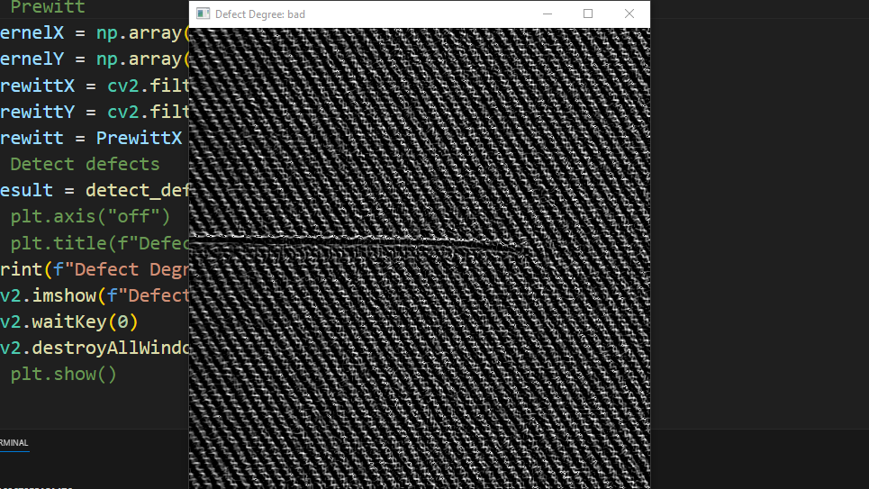
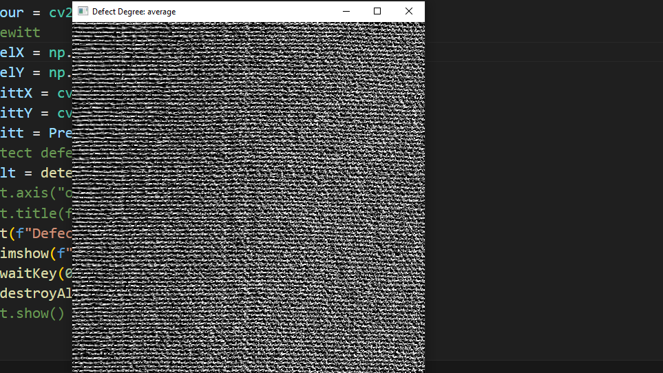

# Description

Fabric image defect detection using one-class classification.
This script requires you to have a dataset of fabric images, with the majority of the images being defect-free.
With the right adjustments and dataset, defect detection should work for all kinds of materials.

# Screenshots

